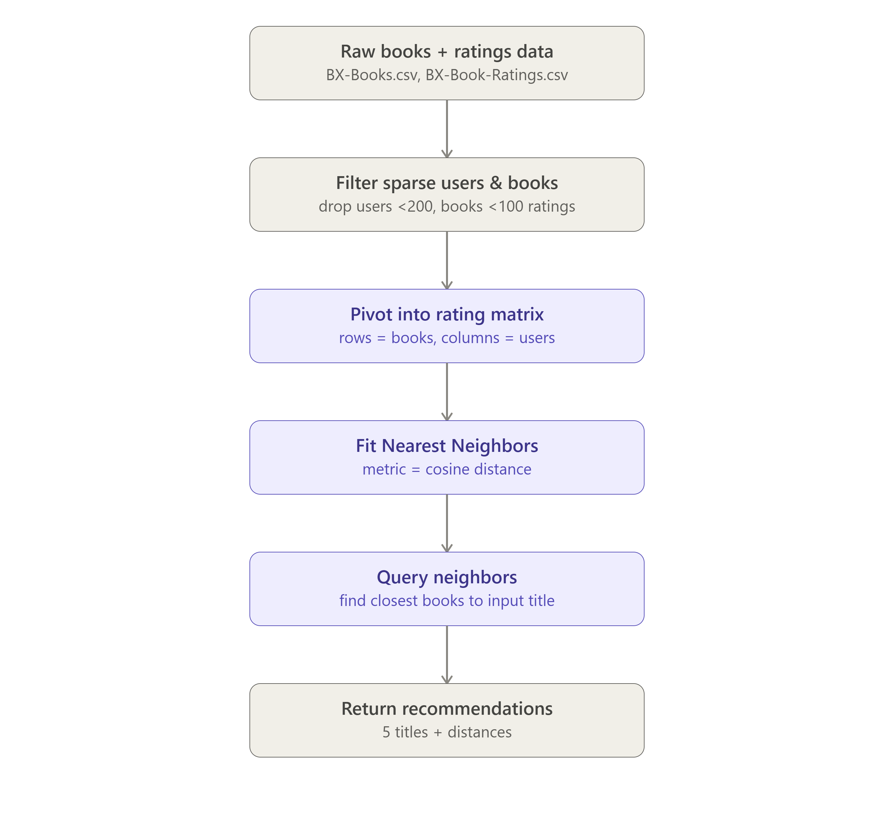

# 📚 Book Recommendation System using KNN

> **freeCodeCamp Machine Learning with Python - Project 3/5**

This project implements a **Book Recommendation System** using the **K-Nearest Neighbors (KNN)** algorithm. The system recommends books to users based on their reading history and preferences. It is designed to handle sparse datasets and provide personalized recommendations efficiently.

---

## Features
- Filters sparse users and books to improve recommendation quality.
- Uses **Cosine Similarity** to measure user and book similarity.
- Provides personalized book recommendations based on user preferences.
- Scalable to large datasets with efficient filtering and similarity computation.

---

## Dataset
The dataset contains:
- **Users**: Unique identifiers for readers.
- **Books**: Titles or ISBNs of books.
- **Ratings**: User ratings for books (e.g., 1-5 scale).

The dataset is preprocessed to remove sparse users (users with fewer than 200 ratings) and sparse book (books with fewer than 100 ratings).

---

## Model Architecture

The recommendation system follows this flow:

1. **Data Preprocessing**:
   - Filter sparse users and books.
   - Normalize ratings for consistency.
2. **Similarity Computation**:
   - Use **Cosine Similarity** to compute user-user or book-book similarity.
3. **KNN Algorithm**:
   - Identify the top `k` nearest neighbors for a user or book.
4. **Recommendation Generation**:
   - Aggregate ratings from neighbors to recommend books.

Below is the architecture flow diagram:



---

## 🛠️ Installation and Usage

1. Clone the repository:
   ```bash
   git clone https://github.com/soufianezekaoui/fCC-ml-projects-RPS-SMS-HealthCosts-BookReco.git

   cd book-recommendation-knn
   ```

2. Install and import libraries

3. Run the Jupyter Notebook:
   ```bash
    jupyter fcc_book_recommendation_knn.ipynb
   ```

4. Test the model:
   ```bash 
    run the finel test cell
   ```

5. Results
- The system achieves high-quality recommendations by focusing on active users and popular books.
- Example recommendations:
    - User A: "The Catcher in the Rye", "To Kill a Mockingbird"
    - User B: "1984", "Brave New World"

---

## Future Work

- Implement collaborative filtering for better scalability.
- Add support for hybrid recommendation (content + collaborative).
- Integrate a web-based user interface for easier interaction.

---

## 🤝 Contributing

- Contributions are welcome! If you'd like to improve this project, feel free to fork the repository and submit a pull request.

---

## 📜 License

This project is licensed under the MIT License. See the [LICENSE](https://github.com/soufianezekaoui/fCC-ml-projects-RPS-SMS-HealthCosts-BookReco/blob/rock-paper-scissors/LICENSE) file for details.

## 🙏 Acknowledgments

- **freeCodeCamp**      - For the amazing Machine Learning curriculum

## 👨‍💻 Author

**Soufiane ZEKAOUI**
- GitHub: [@soufianezekaoui](https://github.com/soufianezekaoui)
- LinkedIn: [Soufiane Zekaoui](https://linkedin.com/in/soufiane-zekaoui-445b1b352/)
- Portfolio: [My-Personal-Website](https://soufianezekaoui.github.io/my_soufianeze_portfolio/)

---

<div align="center">

**Built with ❤️ for the freeCodeCamp Machine Learning with Python Certification**

⭐ Star this repo if you found it helpful!

</div>
