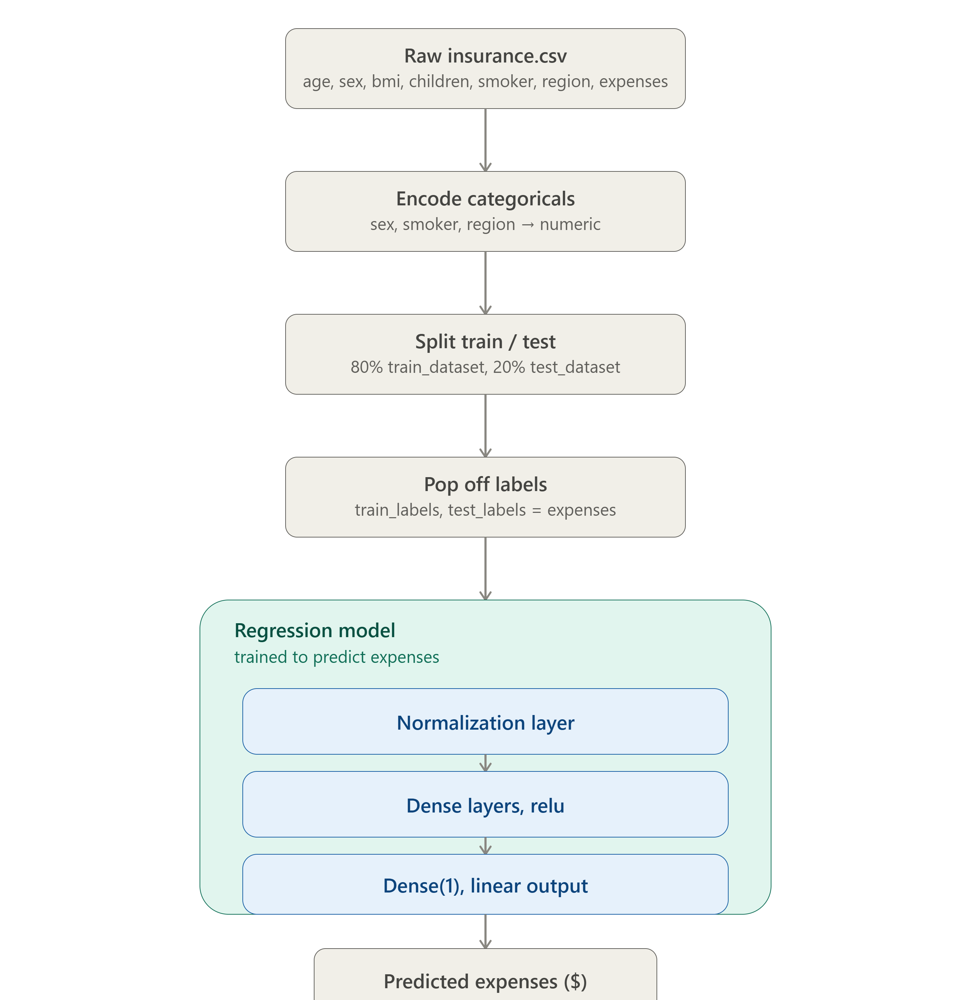

# 🩺💰📈 Predicting Health Costs with Regression

> **freeCodeCamp Machine Learning with Python - Project 4/5**

## Project Architecture

This project demonstrates the use of machine learning to predict health insurance costs based on various factors such as age, BMI, and other demographic data. The model is built using TensorFlow and employs a regression approach to predict continuous values.

---

## Features

- **Data Preprocessing**: Includes normalization and encoding of categorical variables.
- **Model Architecture**: A fully connected neural network with two hidden layers.
- **Loss Function**: Mean Absolute Error (MAE) for robust regression performance.
- **Visualization**: Training and validation loss plots to monitor model performance.

---

## Project Highlights

- **Architecture**: The model consists of a normalization layer, two dense layers with ReLU activation, and an output layer for regression.
- **Regularization**: Dropout layers and early stopping are used to prevent overfitting.
- **Performance Metrics**: MAE and MSE are used to evaluate the model's accuracy.

## Project Architecture

The following diagram illustrates the architecture of the project:


## 🛠️ Installation and Usage

1. Clone the repository:
   ```bash
   git clone https://github.com/soufianezekaoui/fCC-ml-projects-RPS-SMS-HealthCosts-BookReco.git

   cd health-costs-linear-regression
   ```

2. Install and import libraries

3. Run the Jupyter Notebook:
   ```bash
    jupyter notebook fcc_predict_health_costs_with_regression.ipynb
   ```

4. Test the model:
   ```bash 
    run the finel test cell
   ```

5. Results
- The model achieves a low MAE on the test set, demonstrating its ability to predict health costs accurately.
- Training and validation loss plots show consistent convergence.

## Future Improvements

- Experiment with additional features to improve prediction accuracy.
- Test the model on larger datasets for better generalization.

---

## 🤝 Contributing

- Contributions are welcome! If you'd like to improve this project, feel free to fork the repository and submit a pull request.

---

## 📜 License
This project is licensed under the MIT License. See the [LICENSE](https://github.com/soufianezekaoui/fCC-ml-projects-RPS-SMS-HealthCosts-BookReco/blob/rock-paper-scissors/LICENSE) file for details.

## 🙏 Acknowledgments

- **freeCodeCamp**      - For the amazing Machine Learning curriculum

## 👨‍💻 Author

**Soufiane ZEKAOUI**
- GitHub: [@soufianezekaoui](https://github.com/soufianezekaoui)
- LinkedIn: [Soufiane Zekaoui](https://linkedin.com/in/soufiane-zekaoui-445b1b352/)
- Portfolio: [My-Personal-Website](https://soufianezekaoui.github.io/my_soufianeze_portfolio/)

---

<div align="center">

**Built with ❤️ for the freeCodeCamp Machine Learning with Python Certification**

⭐ Star this repo if you found it helpful!

</div>
