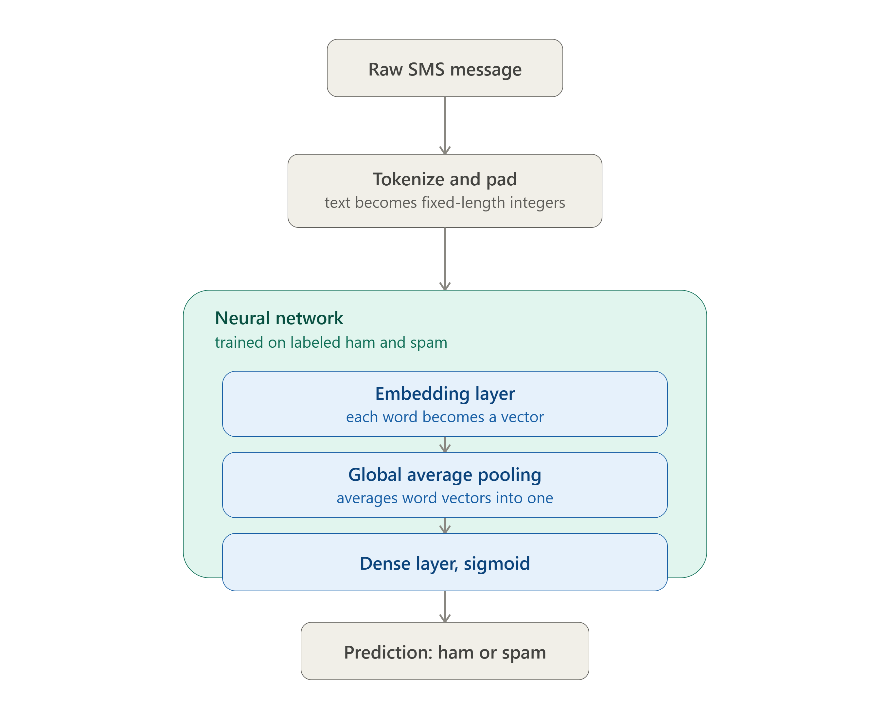
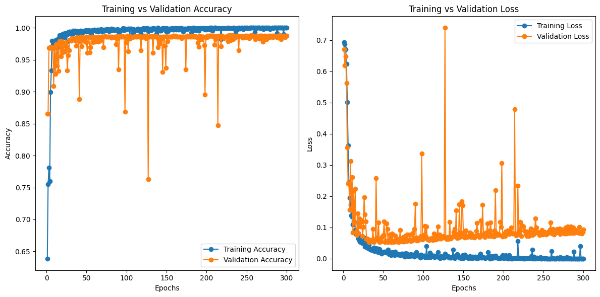

# 📧 Neural Network SMS Text Classifier

> **freeCodeCamp Machine Learning with Python - Project 5/5**

This project implements a **Neural Network SMS Text Classifier** that distinguishes between **spam** and **ham** (non-spam) messages. The model is built using **TensorFlow/Keras** and trained on a dataset of SMS messages provided by freeCodeCamp. It leverages **Natural Language Processing (NLP)** techniques to preprocess text data and classify messages with high accuracy.

---

## 🚀 Features

- **Binary Classification**: Classifies SMS messages as either "spam" or "ham."
- **Deep Learning**: Utilizes a neural network with an embedding layer for text classification.
- **Text Preprocessing**: Includes tokenization, vectorization, and sequence padding.
- **Evaluation Metrics**: Tracks training and validation accuracy/loss for performance analysis.
- **Test Functionality**: Includes a test suite to validate the model's predictions.

---

## 🛠️ Tech Stack

- **Programming Language**: Python
- **Libraries**: TensorFlow, Keras, Pandas, NumPy, Matplotlib
- **Tools**: Jupyter Notebook, Visual Studio Code

---

## 📂 Project Structure

```
neural-network-sms-classifier/
├── fcc_sms_text_classification.ipynb            # Jupyter Notebook 
├── README.md                                    # Project documentation
├── sms_classifier_final_architecture.png        # Project Architecture
├── train-data.tsv                              
└── valid-data.tsv

*Generated by FileTree Pro Extension*
```

---

## 📊 Model Architecture



The model uses the following architecture:
1. **Text Vectorization**: Converts raw text into numerical sequences.
2. **Embedding Layer**: Learns word embeddings for the input text.
3. **Global Average Pooling**: Reduces the sequence dimension.
4. **Dense Layers**: Fully connected layers with ReLU activation.
5. **Output Layer**: Sigmoid activation for binary classification.

---

## 🧪 How It Works

1. **Data Preprocessing**:
   - Tokenizes and vectorizes SMS messages.
   - Pads sequences to ensure uniform input size.
2. **Model Training**:
   - Trains the neural network on labeled SMS data.
   - Tracks training and validation accuracy/loss.
3. **Prediction**:
   - Classifies new SMS messages as "spam" or "ham."

---

## 📈 Performance

The model was trained for **300 epochs** and evaluated on a validation set. Below is a sample performance graph:

### Training vs Validation Accuracy/Loss


---

## 🧩 Example Predictions

Here are some example predictions made by the model:

| **Message**                                                   | **Prediction** |
|---------------------------------------------------------------|----------------|
| "how are you doing today"                                     | ham            |
| "sale today! to stop texts call 98912460324"                  | spam           |
| "you have won £1000 cash! call to claim your prize."          | spam           |
| "i'll bring it tomorrow. don't forget the milk."              | ham            |

---

## 🛠️ Installation and Usage

1. Clone the repository:
   ```bash
   git clone https://github.com/soufianezekaoui/fCC-ml-projects-RPS-SMS-HealthCosts-BookReco.git

   cd sms-text-classifier
   ```

2. Install and import libraries

3. Run the Jupyter Notebook:
   ```bash
    jupyter notebook fcc_sms_text_classification.ipynb
   ```

4. Test the model:
   ```bash 
    test_predictions()
   ```

---

## 🧠 Skills Demonstrated

- Deep Learning: Designed and trained a neural network for text classification.
- NLP: Preprocessed text data using tokenization, vectorization, and sequence padding.
- Model Evaluation: Analyzed training/validation metrics and visualized performance.
- Problem Solving: Debugged and optimized the model to handle imbalanced datasets.

---

## 🤝 Contributing

- Contributions are welcome! If you'd like to improve this project, feel free to fork the repository and submit a pull request.

---

## 📜 License
This project is licensed under the MIT License. See the [LICENSE](LICENSE) file for details.
