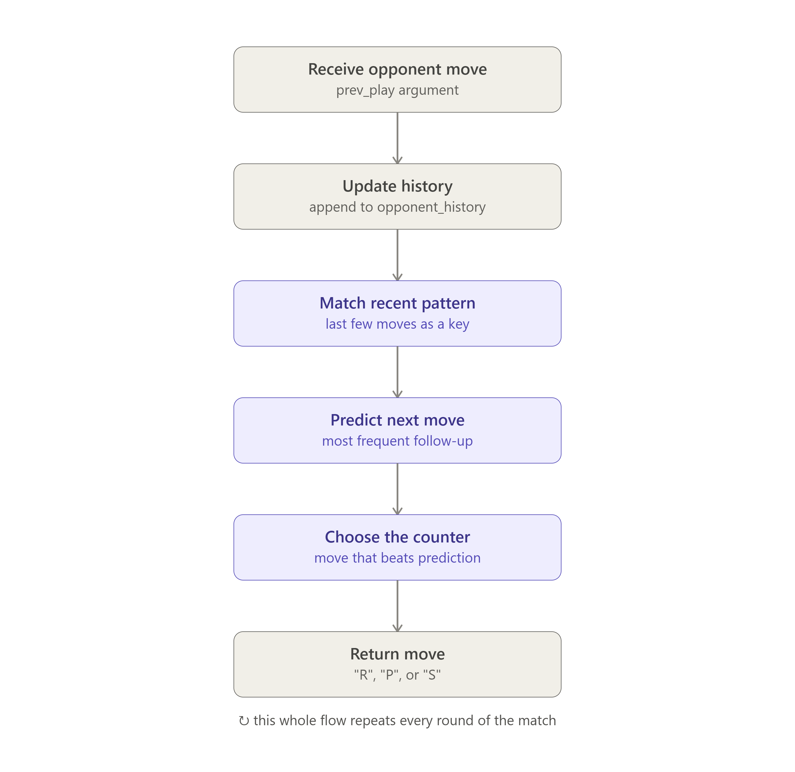
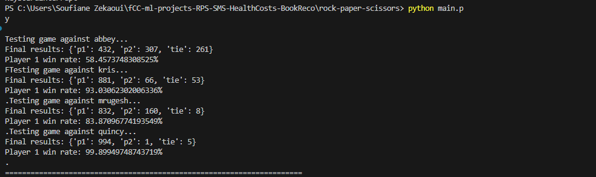

# 🪨📄✂️ Rock-Paper-Scissors

> **freeCodeCamp Machine Learning with Python - Project 1/5**

This project implements a Rock-Paper-Scissors game with a strategy-based AI opponent. The AI predicts the opponent's next move based on their recent move history and plays the move that beats the prediction.

## Features

- **AI Strategy**: The AI uses pattern recognition to predict the opponent's next move.
- **Customizable**: The number of moves used for pattern recognition can be adjusted.
- **Persistent State**: The AI retains knowledge of patterns across multiple rounds.
- **Test Coverage**: Includes unit tests to ensure the correctness of the AI logic.

## Project Architecture

The following diagram illustrates the logic and flow of the project:



## How It Works

1. The AI tracks the opponent's move history.
2. It identifies patterns in the opponent's recent moves.
3. Based on the identified pattern, the AI predicts the next move.
4. The AI plays the move that beats the predicted move.

## Usage

1. Clone the repository:
   ```bash
   git clone https://github.com/soufianezekaoui/fCC-ml-projects-RPS-SMS-HealthCosts-BookReco.git
   ```
2. Navigate to the project directory:
   ```bash
   cd rock-paper-scissors
   ```
3. Run the game:
   ```bash
   python RPS.py
   ```

## Testing

Unit tests are included to verify the AI's logic. To run the tests:
```bash
python main.py
```

Below is an example of the test results:



## Requirements

- Python 3.7 or higher

## Contributing

Contributions are welcome! Feel free to open issues or submit pull requests.

## License

This project is licensed under the MIT License. See the [LICENSE](LICENSE) file for details.
```
## 🙏 Acknowledgments

- **freeCodeCamp**      - For the amazing Machine Learning curriculum

## 👨‍💻 Author

**Soufiane ZEKAOUI**
- GitHub: [@soufianezekaoui](https://github.com/soufianezekaoui)
- LinkedIn: [Soufiane Zekaoui](https://linkedin.com/in/soufiane-zekaoui-445b1b352/)
- Portfolio: [My-Personal-Website](https://soufianezekaoui.github.io/my_soufianeze_portfolio/)

---

**Built with ❤️ for the freeCodeCamp Machine Learning with Python Certification**

⭐ Star this repo if you found it helpful!